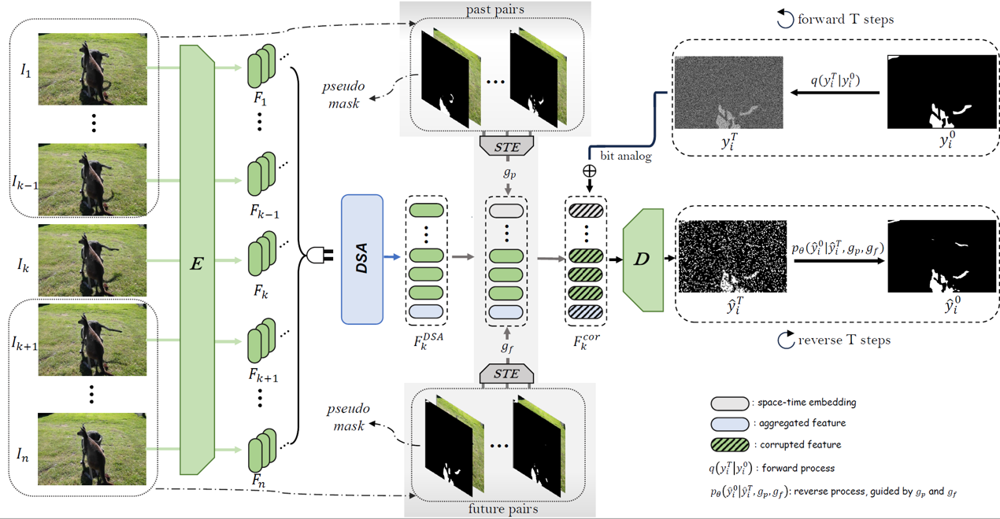

## STAN for video shadow detection

## Quick View

This is an official repo for STAN.  We use Diffusion for video shadow detection. 

The paper is under review.

Visit our [project page](https://haipengzhou856.github.io/paper_page/STAN/STAN.html) to find more details. Thanks for your attention : )




## Preparation

### dataset

Please see [ViSha](https://erasernut.github.io/ViSha.html) to download it, and modify the data dir_path in `configs/xxx.yml`. 

### package

My basic environment: `Python=3.8, CUDA=12.2, Pytorch=1.11.0` . And essential packages are requires,  use

```
conda env create -f environment.yaml
```

### use **[accelerate](https://huggingface.co/docs/accelerate/index)** 🤗to apply distribute train

see the doc from **[accelerate](https://huggingface.co/docs/accelerate/index)**🤗, and run the command:

```
accelerate config
```

to adjust the platform settings, like number of GPUs, mix-precision and etc.

## Training

Use different configs and modify on `main.py`, then run

```
accelerate launch --main_process_port 29050 main.py
```

And it will produce following outputs

```
--output
----model_name
------exp_name
--------ckpt_path       # store the ckpt
--------log_path        # store the logs
--------pred_result     # store the predictions
--------tb_path         # store the tensorboard information
```


## TODO

* Pre-trained ckpt. I cannot find and match the best one 😓 when I modify the network structure,  and I'm trying to reconstruct it. 
* The `engine/tester.py` . I'm lazy to apply it 🤪. Maybe you can just modify the `engine/trainer.py` for evaluation.

## Note

* We conduct all the experiments with 4GPUs to get stable results, but when we transfer to single or two GPUs the performance gets decrease. This is may caused by  the **batch-size**.  We find larger batch size performs better,  24G may not enough. You may adjust it by custom ways. 